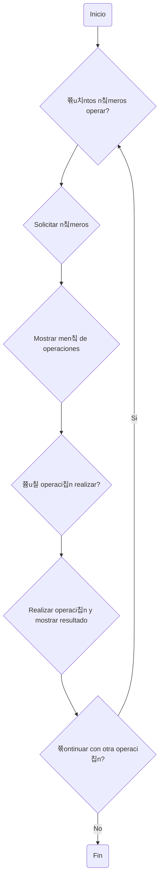

# Calculadora en Python🧮
Este proyecto es una calculadora interactiva en Python que permite al usuario realizar operaciones básicas como suma, resta, multiplicación y división.

## Diagrama de Flujo 📈

A continuación, se muestra un diagrama de flujo que representa el funcionamiento del programa:



<br>

<hr>

## Código del Programa 📜
El programa está dividido en varias funciones para facilitar su comprensión y mantenimiento.

<br>

## funciones.py
```python
def solicitar_numeros(cantidad):
    """Solicita al usuario la cantidad de números que se especifica."""
    # Código de la función...

def mostrar_menu():
    """Muestra el menú de operaciones al usuario."""
    # Código de la función...

def realizar_operacion(operacion, numeros):
    """Realiza la operación que el usuario eligió."""
    # Código de la función...
```
## app.py
```python
from funciones import solicitar_numeros, mostrar_menu, realizar_operacion

def main():
    # Código de la función...

if __name__ == "__main__":
    main()
```
<hr>

## Uso del Programa 👥

Para usar el programa, el usuario debe ejecutar el archivo app.py. 

El programa le pedirá que introduzca la cantidad de números que quiere operar, validando que ingrese solo números, luego le pedirá cada uno de esos números. 

A continuación, se mostrará un menú con las operaciones disponibles y le pedirá al usuario que elija una. 

Después de realizar la operación, se mostrará el resultado y se le preguntará si quiere realizar otra operación. Si el usuario responde "si", el proceso se repetirá. Si responde cualquier otra cosa, el programa se terminará.


